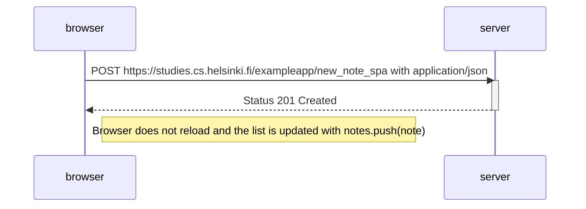

```mermaid
sequenceDiagram
    participant browser
    participant server

    browser->>server: POST https://studies.cs.helsinki.fi/exampleapp/new_note_spa with application/json 
    activate server
    server-->>browser: Status 201 Created
    deactivate server

    Note right of browser: Browser does not reload and the list is updated with notes.push(note)
```